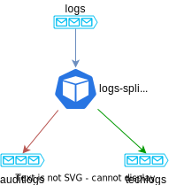

# terraform-module-k8s-logstash-logs-splitter

Reads logs fom a Kafka topic and split logs according to a key

## How it works



The *logs* topic contains json-based messages. Two key fields are used:
* `log_type` from the main message (default value)
* `_log_type` in the nested json-based data within `message` (default value)

If their value is *application* (default value), then the nested json is extracted to the main message and the field is tested.

```json
{
    "log_type":"application",
    "message":"{\"_log_type\":\"audit\",\"message\":\"Hello World from app !\"}"
}
```

If their value is *audit*, then the message is routed to the *auditlogs* topic.

```json
{
    "log_type":"audit",
    "message":"Hello World from audit !"
}
```

<!-- BEGINNING OF PRE-COMMIT-TERRAFORM DOCS HOOK -->

<!-- END OF PRE-COMMIT-TERRAFORM DOCS HOOK -->